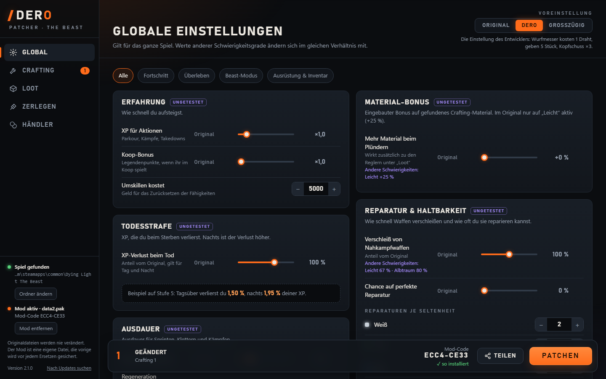

# DERO-Patcher für Dying Light: The Beast

Spielregeln anpassen, ohne Originaldateien anzufassen: Crafting-Rezepte, Loot, Zerlegen, Händlerpreise und spielweite Werte wie Erfahrung, Todesstrafe, Ausdauer, Heilung, Beast-Modus, Reparatur und Inventar. Mit Koop-Unterstützung und automatischen Updates.



## Download und Start

1. **[Neueste Version herunterladen](https://github.com/DERO129media/dl-modding-patcher/releases/latest)**: unter „Assets“ die Datei `DERO-Patcher.exe` (oder die `.zip`).
2. In einen eigenen Ordner legen, z. B. `Desktop\DERO-Patcher`. Nicht unter „Programme“, sonst kann sich das Tool nicht selbst aktualisieren.
3. Doppelklick. Eine Installation ist nicht nötig.
   Zeigt Windows „Der Computer wurde durch Windows geschützt“: auf **„Weitere Informationen“** und dann auf **„Trotzdem ausführen“** klicken. Die Meldung kommt, weil die `.exe` nicht signiert ist.
4. Das Tool findet das Spiel normalerweise selbst. Sonst den Ordner `Dying Light The Beast` in `steamapps\common` auswählen.
5. Werte einstellen oder eine Voreinstellung wählen. Dann **das Spiel schließen** und auf **Patchen** klicken.

Beim Spielstart erscheint danach „Modified game data detected“. Das ist normal.

**Voraussetzungen:** Windows 10 oder 11, Microsoft Edge oder Chrome (für das Fenster) und die Steam-Version des Spiels.

## Zusammen spielen (Koop)

Das Spiel lässt nur Spieler zusammen, deren Spieldaten exakt gleich sind. Sonst heißt es „Beitritt zum Spiel nicht möglich … Spieldaten unterschiedlich“.

1. Einer stellt die Werte ein, klickt auf **Teilen / Übernehmen** und schickt den Code (`DERO2.…`) an die Mitspieler.
2. Die anderen fügen ihn unter **Teilen / Übernehmen → Code übernehmen** ein und patchen ebenfalls.
3. Unten rechts steht der **Mod-Code**. Er muss bei allen gleich sein.

Am besten nutzen alle dieselbe Tool-Version. Sie steht unten links.

## Was lässt sich ändern?

| Bereich | Beispiele |
|---|---|
| Crafting | Materialkosten, Menge pro Craft, Kopfschuss bei Wurfwaffen (37 Rezepte) |
| Global | Erfahrung, Todesstrafe, Ausdauer, Heilung, Beast-Modus, Material-Bonus, Reparatur, Inventarplätze, Stapelgrößen |
| Loot | Menge pro Fund für Materialien und Geld |
| Zerlegen | Material beim Zerlegen von Waffen |
| Händler | Verkaufs- und Einkaufspreise |

Etwas funktioniert nicht wie erwartet? [Issue anlegen](https://github.com/DERO129media/dl-modding-patcher/issues).

## Gut zu wissen

- **Originaldateien bleiben unverändert.** Der Mod ist eine eigene Datei `ph_ft\source\data2.pak` (bis `data7.pak`), die das Spiel zusätzlich lädt.
- **Mod entfernen** löscht nur diese Datei. Danach lädt das Spiel wieder die Originaldaten. **Dein Spielstand wird dabei nicht zurückgesetzt:** Was du mit dem Mod gesammelt oder gespeichert hast, bleibt. Sichere deinen Spielstand vorher, wenn du auf Nummer sicher gehen willst.
- **Sicherungen:** Vor jedem Ersetzen oder Entfernen sichert das Tool die bisherige Mod-Datei in `%LOCALAPPDATA%\DERO-Patcher\Sicherungen`.
- **Andere Mods:** Mod-Dateien, die nicht vom DERO-Patcher stammen, fasst das Tool nie an. Ändert ein anderer Mod dieselben Spieldateien, zeigt es einen Hinweis.
- **Nach einem Spiel-Update** meldet das Tool, dass der Mod veraltet ist. Dann einfach neu patchen, im Koop alle.
- **Updates des Tools** kommen automatisch: Beim Start erscheint oben ein Hinweis, ein Klick installiert die neue Version (per Prüfsumme kontrolliert).
- **Deinstallieren:** im Tool auf „Mod entfernen“ klicken, dann die `.exe` löschen. Einstellungen und Sicherungen liegen in `%LOCALAPPDATA%\DERO-Patcher` und können ebenfalls weg.

## Haftung und Marken

Inoffizielles Fan-Tool, nicht verbunden mit Techland. *Dying Light* ist eine Marke von Techland. Die Nutzung erfolgt auf eigene Gefahr. Das Repository enthält keine Spieldateien. Das Tool liest die Originalwerte zur Laufzeit aus deiner Installation.

## Lizenz

[MIT](LICENSE): Du darfst den Code nutzen, ändern und weitergeben, solange der Lizenzhinweis erhalten bleibt.

---

## Für Entwickler

Gebraucht wird nur Windows. `build.bat` nutzt den C#-Compiler aus .NET Framework 4 (C# 5). Die Oberfläche (`ui/index.html`) wird in die `.exe` eingebettet.

```bash
build.bat                                                        # → dist\DERO-Patcher.exe
dist\DERO-Patcher.exe --selftest "<Spielordner-Kopie>" test.pak   # patcht ohne Oberfläche, schreibt test.pak.log
dist\DERO-Patcher.exe --dev --game "<Spielordner-Kopie>" --ui ui  # Dev-Server: http://127.0.0.1:8732/?t=dev
```

Teste immer gegen eine **Kopie** des Spielordners (`data0.pak` und `data_lang\datade.pak` reichen), nie gegen die echte Installation.

| Datei | Inhalt |
|---|---|
| [docs/architektur.md](docs/architektur.md) | Aufbau, API, Dateisicherheit, Tests, Updater |
| [docs/spieldaten.md](docs/spieldaten.md) | Welche Werte in welcher Spieldatei stehen, Skript-Syntax |
| [docs/modding-mechanik.md](docs/modding-mechanik.md) | Wie Paks geladen werden, Koop, Konflikte |
| [docs/formate.md](docs/formate.md) | Binärformate (Lokalisierung, Spielstand) |
| [docs/offene-fragen.md](docs/offene-fragen.md) | Was noch nicht geklärt oder getestet ist |
| [CHANGELOG.md](CHANGELOG.md) | Änderungen je Version |

**Release:** Version in `src/Program.cs` (`AssemblyVersion`) erhöhen, Abschnitt `## vX.Y.Z` in `CHANGELOG.md` schreiben, committen, `git tag -a vX.Y.Z -m vX.Y.Z` und `git push --follow-tags`. Die GitHub Action baut und veröffentlicht die `.exe`.
